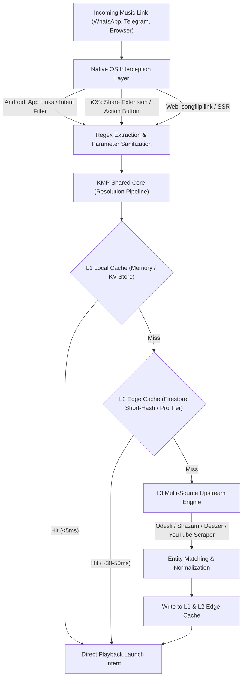
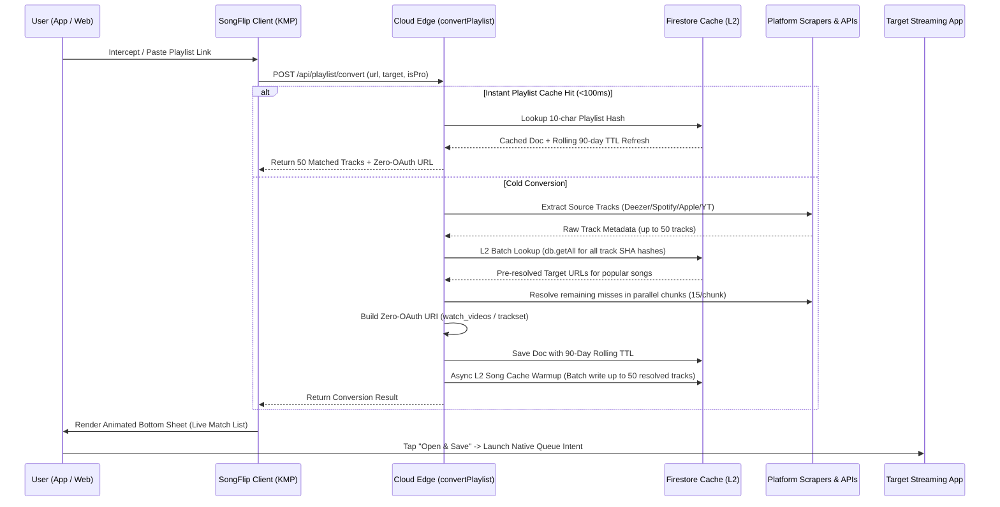

# SongFlip Architecture & Internals 🏛️

This document outlines the technical design, architectural patterns, and resolution pipeline powering **SongFlip**.

SongFlip is designed to solve a simple problem with high engineering rigor: **How to intercept, resolve, and redirect cross-platform music links with sub-50ms latency, zero intermediate UI, and zero user tracking.**

---

## 1. High-Level System Overview

SongFlip operates across three client layers (Android, iOS, Web) backed by a shared Kotlin Multiplatform engine and a serverless edge cache:



---

## 2. The Resolution Pipeline (Step-by-Step)

### Step 1: Deterministic URL Sanitization
Music streaming services append aggressive tracking clutters to share links (e.g. `?si=...`, `?context=...`, `?utm_source=...`, `intl-*` subdomains).
Before hashing or resolving, the URL is strictly canonicalized:
- Tracking query parameters are stripped.
- Canonical entity types (`track`, `album`, `artist`, `playlist`) and platform IDs are extracted via regex guards.
- Eliminating tracking parameters maximizes cache hit rates across different social networks.

### Step 2: Tiered Caching Architecture

| Tier | Technology | Latency | Scope & Invalidation |
|---|---|---|---|
| **L1 (Local)** | In-Memory / SharedPreferences (Android) & NSUserDefaults (iOS) | `< 5 ms` | Device-only. Sub-millisecond playback launch for repeated tracks with 90-day rolling TTL. Always active on all devices. |
| **L2 (Edge Cache)** | Serverless Firestore Edge *(Pro Tier read / Crowdsourced write)* | `~30–50 ms` | Global, indexed via 12-char SHA-256 short hashes (`/resolve` & `/ingest`). Reading is reserved for SongFlip PRO & Web Converter (`songflip.link/s/...`), while background ingestion is crowdsourced across all platforms (Android, iOS, Web). |
| **L3 (Upstream)** | Multi-Provider Aggregator | `~200–500 ms` | Cold fallback only. Queries Odesli, iTunes Search API, Deezer Catalog API, and Shazam REST directly from the client. |

> **Architectural Note on Tiering:** SongFlip's client engine is completely autonomous and operates with 100% functionality on device using L1 + L3 alone. The L2 Edge Cache is an optional, serverless performance tier that eliminates client-side network roundtrips for popular music entities.

### Step 3: Self-Healing & Edge Cases
- **Playlist Entity Interception:** While standard redirect flows focus on single tracks and albums, incoming playlist URLs (`/playlist/...`) are intercepted early and routed to the **Universal Playlist Converter (v1.4+)** bottom sheet in the native client rather than failing (tracked via `playlist_routed`).
- **Unsupported Audio Entities (Podcasts, Audiobooks):** Passing podcast episodes/shows or audiobooks would cause 404s and false-positive error telemetry (`link_flip_failed`). SongFlip intercepts these entities at Step 1 (`isPodcastOrAudiobookUrl()`) and short-circuits the pipeline with structured graceful fallbacks (`ResolutionResult.PodcastOrAudiobook`), presenting direct shortcuts to open the native app or copy the link with clean telemetry (`podcast_intercepted` / `audiobook_intercepted`).
- **Social Sessions & Personal Profiles (Spotify Blend, Jam, Live, Users):** Non-music session links (such as `open.spotify.com/blend/` or `/jam/`) cannot be converted across providers. SongFlip intercepts these via `isSocialOrSessionUrl()` and seamlessly forwards them directly to the native host app (`ResolutionResult.UnsupportedEntity`), tracking `unsupported_entity_intercepted` instead of error events.
- **YouTube Shorts Normalization:** Shared YouTube Shorts links (`youtube.com/shorts/{id}`) are automatically canonicalized into full video/track links (`music.youtube.com/watch?v={id}`), enabling immediate cross-platform flipping without failure.
- **Self-Titled Albums:** Search APIs frequently map an album name (matching the artist's name) to a single track video instead of the album playlist. SongFlip enforces strict entity type validation (`music.youtube.com/playlist?list=OLAK5uy_...` for albums) to prevent single-video downgrades.
- **Shazam Links:** Apple's Shazam CDN blocks standard user agents with HTTP 405. SongFlip leverages the internal discovery REST endpoint (`amp.shazam.com/discovery/v5/...`) with native headers to retrieve clean Apple Music and ISRC identifiers without auth.
- **Offline Buffering & Intermittent Network Resilience (v1.4.15+):** When a user taps a music link during low or missing connectivity (e.g. subway tunnels, elevators, dead zones), SongFlip does not crash or fail with dead-end error toasts. The native layer registers a reactive network state listener (`NetworkUtils.observeNetworkState()`). An animated bottom sheet (`OfflineWaitingBottomSheet`) holds the parsed entity intent, displays real-time connection status with auto-retry, and executes the resolution pipeline the instant `NET_CAPABILITY_INTERNET` and `NET_CAPABILITY_VALIDATED` are restored—launching target playback seamlessly.
- **Regional Domains & Morphe/ReVanced:** On Android, custom modded packages (e.g. `app.morphe.android.apps.youtube.music`, `app.revanced.android.apps.youtube.music`, `app.rvx...`) are prioritized and regional Amazon Music domains (`music.amazon.de`, `music.amazon.co.uk`) are dynamically supported.

### Step 4: Cross-Platform Entity Mapping & Graceful Fallback Strategy

SongFlip enforces deterministic 1:1 entity mapping across streaming platforms:
- **Track $\rightarrow$ Track:** Direct playback launch (`autoplay` / native deep-link intent).
- **Album $\rightarrow$ Album:** Direct album view (playlist / collection ID).
- **Artist $\rightarrow$ Artist:** Direct artist profile page.
- **Playlist $\rightarrow$ Playlist:** Universal batch conversion with Zero-OAuth queue import (up to 50 tracks).

When an upstream resolver (e.g. Odesli) lacks a mapping for a target platform (frequent with regional identifiers such as Amazon Music ASINs), SongFlip applies a tiered fallback rather than failing hard:

1. **Secondary Auth-Free API Resolvers:**
   - **Apple Music:** iTunes Search API directly queries collection/track IDs.
   - **Deezer:** Deezer Public Search API resolves direct album/track URLs.
   - **YouTube Music:** YouTube Music scraper resolves `browse/MPREb_...` album IDs and `watch?v=...` video IDs.
2. **Deterministic Search Fallback (Graceful Degradation):**
   Platforms without open, auth-free public search APIs (**Amazon Music**, **Spotify**, **Tidal**) gracefully fall back to pre-populated search deep-links (e.g. `amznmp3://music.amazon.com/search/<Artist>+<Album>` or `spotify:search:...`). This guarantees that the user always lands on the desired content with zero dead-ends.

| Target Platform | Track Intent | Album Intent | Artist Intent | Secondary Lookup | Miss Fallback |
| :--- | :--- | :--- | :--- | :--- | :--- |
| **YouTube Music** | `watch?v=` | `browse/MPREb_...` / `playlist?list=` | `channel/UC...` | ✅ YouTube Scraper | `music.youtube.com/search?q=` |
| **Apple Music** | `/song/<id>` | `/album/<id>` | `/artist/<id>` | ✅ iTunes API | `music.apple.com/search?term=` |
| **Deezer** | `deezer://.../track/` | `deezer://.../album/` | `deezer://.../artist/` | ✅ Deezer API | `deezer.com/search/` |
| **Spotify** | `spotify:track:<id>` | `spotify:album:<id>` | `spotify:artist:<id>` | ❌ None (OAuth-only) | `spotify:search:<query>` |
| **Amazon Music** | `amznmp3://... ?trackAsin=` | `amznmp3://.../albums/<ASIN>` | `amznmp3://.../artists/<ASIN>` | ❌ None (ASIN regional) | `amznmp3://music.amazon.com/search/` |
| **Tidal** | `tidal://track/<id>` | `tidal://album/<id>` | `tidal://artist/<id>` | ❌ None (OAuth-only) | `listen.tidal.com/search?q=` |

---

## 3. Universal Playlist Conversion Architecture (Zero-OAuth Pipeline)

SongFlip includes a high-performance **Universal Playlist Converter** operating without requiring user account credentials or OAuth authorizations:



### Core Playlist Pipeline Components:
1. **Extraction Scrapers:** Zero-auth extraction for Deezer API (`/playlist/{id}`), Spotify embed scraper, YouTube Music initial page data, and Apple Music meta tags.
2. **L2 Batch Cache Acceleration:** Evaluates all track URLs simultaneously via a single Firestore batch lookup (`db.getAll(...docRefs)`) to reuse previously resolved single-track mappings in `<50ms`.
3. **Parallel Chunk Matching:** Resolves remaining cache misses in concurrent chunks (15 at a time) via target search scrapers and iTunes API.
4. **Zero-OAuth Queue Generation:**
   - **YouTube Music:** Resolves `www.youtube.com/watch_videos?video_ids=...` via HTTP 303 location redirection into a direct `music.youtube.com/watch?v={id}&list=TLGG...` queue playlist.
   - **Spotify:** Generates `spotify:trackset:{Title}:{id1},{id2}...` URI schemes.
5. **50-Track Sweet Spot:** Optimized to 50 tracks to align with YouTube's strict server-side `watch_videos` limit and Spotify URI length constraints.
6. **SSR Web Sharing (`songflip.link/p/...`):** Server-rendered, localized web pages with CSP hardening, target platform color theming, and individual track preview buttons.
7. **90-Day Rolling TTL Lifecycle:** Playlist records are saved with an `expiresAt` timestamp and automatically refreshed on every web page view or conversion hit. Unused playlists expire cleanly via Firestore TTL policies.
8. **Automatic L2 Song Cache Swarm Warmup:** Every playlist conversion asynchronously writes all successfully resolved tracks into the global Firestore `l2_song_cache` (with multi-index 12-char and 8-char SHA hashes). This automatically seeds the global cache, guaranteeing sub-30ms instant resolutions for any user subsequently flipping these tracks individually.

---

## 4. Kotlin Multiplatform (KMP) Architecture

The codebase separates platform-specific UI from deterministic platform-agnostic business logic:

```text
├── app/                  # Native Android App (Jetpack Compose, Material 3, Quick Settings Tile)
├── iosApp/               # Native iOS App (SwiftUI, Share Extension, App Intents)
├── shared/               # Kotlin Multiplatform Core (Shared by Android & iOS)
│   ├── commonMain/       # Shared URL sanitizers, cache manager, HTTP engine (Ktor), models
│   ├── androidMain/      # Android PackageUtils & Intent resolution helpers
│   └── iosMain/          # iOS Framework export & Swift bridging
└── functions/            # Firebase Cloud Functions (TypeScript edge proxy, SSR landing pages, HMAC vouchers)
```

### Shared Logic Benefits:
- **Unified Engine (v1.4.7+)**: Both Android and iOS run 100% on the identical `SongLinkEngine.shared` and `LinkCache` core. Legacy redundant Android networking and repository layers were completely eliminated.
- **Consistent Resolver Behavior:** Both platforms share identical regex rules and parsing priority. A song resolved on Android resolves identically on iOS.
- **Zero Drift:** Bug fixes, URL parsing rules, and caching invariants only need to be written and unit-tested once in `shared/commonMain`.

### iOS Native Share Extension & App Groups:
The iOS architecture decouples the main user interface (`de.goork.SongFlip`) from the background system extension (`de.goork.SongFlip.ShareExtension`):
- **App Group Container (`group.de.goork.songflip`)**: Provides shared IPC storage via `UserDefaults(suiteName:)`. Both the main app and the Share Extension access identical user preferences (`target_platform`, `custom_api_url`) and the shared conversion history (`songflip_conversion_history`).
- **Static KMP Linking**: The KMP framework (`SongFlipKit.xcframework`) is linked statically (`isStatic = true`) into both the main application and the extension bundle, preventing runtime dynamic library lookup issues across extension boundaries.
- **Zero-Friction Sharing**: The extension intercepts incoming URLs or text from any host app (Spotify, Apple Music, Safari, WhatsApp), resolves the target stream in the background via `SongLinkEngine`, appends the conversion to the shared history, and directly triggers playback in the target player.

---

## 5. Privacy & Zero-Tracking Principles

SongFlip is built around strict data minimalism:
1. **No User Accounts:** Users never log in or provide emails.
2. **No Listening Habit Profiling:** Resolved links are never tied to user identities. Cache lookups use anonymous SHA-256 hashes of the music entity URL.
3. **No Third-Party Advertising SDKs:** Zero tracking cookies, zero advertising networks (Google Ads, Meta Pixel, Adjust, AppsFlyer are strictly absent).
4. **Self-Hosted Privacy Telemetry:** Anonymous diagnostic metrics (Aptabase / Umami) with zero cookies, no IP retention, and complete opt-out support.

---

## 6. Timeout-Budgets & Latency Guarantees

To ensure sub-50ms user experience for cached items and prevent hanging UI on flaky networks, SongFlip enforces strict, layered timeout budgets:

| Component / Layer | Timeout Budget | Fallback Strategy / Behavior |
| :--- | :--- | :--- |
| **L1 Local Cache** | `< 5 ms` | Instant in-memory/KV hit $\rightarrow$ Launch player immediately. On miss $\rightarrow$ Proceed to L2 / L3. |
| **L2 Cloud Edge Cache** | `500 ms` | If L2 edge lookup does not respond within 500ms, proceed immediately to L3 direct resolution. |
| **KMP Client Upstream (Ktor)** | `5,000 ms` | Socket & request timeout for Odesli / Shazam / Deezer / YouTube scrapers. |
| **Secondary Fast-Fail Probes** | `2,500 ms` | Fast fallback to deterministic deep-search URL on API timeout. |
| **Cloud Function `/resolve`** | `15 s` | Enforces parallel upstream racing and returns cached response or structured error. |
| **Cloud Function `/convertPlaylist`** | `60 s` | Max execution budget for batch-scraping playlists up to 50 tracks. |
| **SSR `/renderWebShare`** | `10 s` | Fast server-side rendering for OpenGraph preview tags. |
| **Cache Retention (L1 / L2)** | `90 Days` | Rolling 90-day TTL refreshed on each access. |

## 7. Security & Verification

- **HMAC Signed Vouchers:** Promo codes are verified server-side with constant-time cryptographic signatures to prevent brute-force enumeration.
- **SSRF Hardening:** Incoming URL inputs on cloud endpoints are validated against strict whitelist regexes before executing any upstream network call.
- **Role-Based Auth (Custom Claims):** Administrative Firestore access is strictly governed via Firebase Auth Custom Claims (`request.auth.token.admin == true`).

---

## 8. Testing & Quality Assurance Architecture

SongFlip enforces automated test coverage across all layers to ensure zero regressions in the 0-click redirect pipeline:

### Test Suites & Scopes:

| Test Scope | Location | Framework | What is Covered |
| :--- | :--- | :--- | :--- |
| **Shared KMP Core** | `shared/src/commonTest/` | Kotlin Test, Ktor `MockEngine`, Coroutines Test | URL normalization, entity type & platform detection, L1 cache TTL & eviction, all 6 platform resolvers (Spotify, Apple Music, Deezer, Tidal, YouTube Music, SongLink API), Aptabase analytics client. |
| **Android Client** | `app/src/test/` | JUnit 4, OkHttp `MockWebServer`, Coroutines Test | Domain verification info, quick settings tile states, dynamic app shortcuts, coupon redemption & error handling, review prompt rules, L1 hit detection, 24+ locale string formats (`strings.xml`). |
| **Backend Functions** | `functions/src/test/` | Node.js `node:test`, `assert/strict` | Metadata sanitization, SSRF IP blocking, timing-safe HMAC voucher verification, playlist batch conversion & Zero-OAuth encoding, WebShare SSR & crawler bot detection (WhatsApp, Telegram, Twitterbot, Discord). |

### Deterministic Mocking & Isolation:
- **No Live Network Dependencies:** KMP and Android unit tests mock external endpoints using Ktor's `MockEngine` and OkHttp's `MockWebServer` for instant (< 5s), repeatable execution without flaky upstream API rate limits.
- **Fail-Open Network Safety:** System network manager fallbacks are tested to ensure the app never crashes or hangs when connectivity services are unavailable.

### Automated CI/CD Gates & Abort Triggers:
1. **GitHub Actions CI (`.github/workflows/ci.yml`):** Runs `./gradlew test` and `npm test` on every `push` to `main` and on every `pull_request`. Any failure immediately blocks merge.
2. **Release Build Pipeline (`.github/workflows/build-apk.yml`):** Executes `./gradlew :shared:testReleaseUnitTest :app:testReleaseUnitTest` as a strict gate before building or signing binaries. A single test failure aborts APK/AAB generation and Play Store upload completely.
3. **Backend Predeploy Hook (`functions/firebase.json`):** Executes `npm test` prior to deploying Cloud Functions. If tests fail, Firebase CLI aborts the deployment and no code is deployed.

