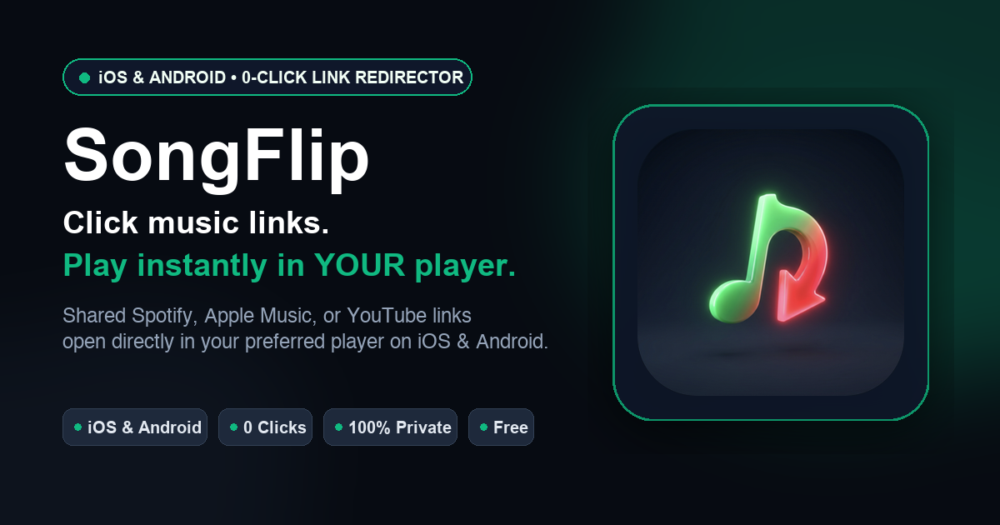

# SongFlip 🎵

<p align="center">
  
</p>

**SongFlip** is an automatic, zero-click music link redirector for Android & iOS (Spotify ⇄ Apple Music ⇄ YouTube Music ⇄ Tidal ⇄ Deezer ⇄ Amazon Music ⇄ SoundCloud ⇄ Bandcamp).

Official Website: [songflip.link](https://songflip.link)

SongFlip runs completely in the background: set it up in 30 seconds, and whenever a friend shares a music link in WhatsApp, Telegram, Instagram, Shazam, or your browser, SongFlip instantly intercepts and converts it to open directly in your preferred music player without any intermediate UI or manual searching.

---

## ✨ Key Features

- **⚡ 0-Click Background Redirect**: Intercepts music links transparently and launches direct playback in your target player.
- **🔎 In-App Direct Search & Flip**: Search for any song or artist directly in SongFlip without leaving the app and launch playback with a single tap.
- **🎛️ Precision Match-Review & Disambiguation [PRO]**: Easily pick alternative versions, recordings, or remixes right from your history or search options.
- **📶 Offline Resilience & Auto-Retry Queue**: If you tap a music link while in a subway, elevator, or spotty coverage, SongFlip holds the intent and automatically resolves and plays the song the second connectivity is restored.
- **📑 Universal Playlist Converter [PRO]**: Convert entire playlists (up to 200 tracks) across Spotify, YouTube Music, Deezer, Apple Music, and more with 1-click Zero-OAuth playback queue launch, automatic duplicate track cleaning, multi-part chunk navigation, universal .M3U8 & .CSV file export, and instant server-side caching.
- **🌐 Playlist Web Sharing (`songflip.link/p/...`) [PRO]**: Share converted playlists as beautiful web landing pages with rich album artwork, 1-click import, and branded single-track preview buttons. *(Try the live demo: [songflip.link/p/76176a1354](https://songflip.link/p/76176a1354))*.
- **🎙️ Cross-Platform Podcast Support**: Seamlessly convert and launch podcast shows and episodes across Spotify, Apple Podcasts, YouTube Music, Pocket Casts, Deezer, and Amazon Music with zero-delay app deep-search and web playback.
- **🎧 Broad Multi-Service Support**: Full any-to-any redirection between:
  - 🟢 **Spotify** (`open.spotify.com`, `spotify.link`)
  - 🔴 **YouTube & YouTube Music** (`music.youtube.com`, `youtu.be`, `youtube.com/shorts`)
  - 🍎 **Apple Music & Podcasts** (`music.apple.com`, `podcasts.apple.com`, `apple.co`, `itunes.apple.com`)
  - 🌊 **Tidal** (`tidal.com`, `listen.tidal.com`)
  - 🟣 **Deezer** (`deezer.com`, `link.deezer.com`, `deezer.page.link`)
  - 🔵 **Amazon Music** (`music.amazon.com`, `music.amazon.de`, `music.amazon.co.uk`, `amzn.to`, `a.co`)
  - 🎙️ **Pocket Casts** (`pocketcasts.com`, `pca.st`)
  - 🟠 **SoundCloud** (`soundcloud.com`, `on.soundcloud.com`)
  - 🎸 **Bandcamp** (`bandcamp.com`, `*.bandcamp.com`)
- **📱 Flexible Player Selection**: When multiple compatible players are installed on your device (e.g. YouTube Music, NewTube, RiMusic, etc.), choose your preferred default player in Settings or switch directly with a single tap from the main player card.
- **⚡ Shazam Link Interception**: Songs identified with Shazam open directly and reliably in your preferred music player.
- **🎯 Quick Player Picker ("Ask every time")**: Optional setting for users with multiple streaming apps to pick where each song should play with a single tap.
- **💿 Full Album, Artist & Podcast Recognition**: Supports single tracks, full albums/EPs, artist channel/discography profiles (including `@handles`), and podcast shows/episodes.
- **🔍 Robust Search Sanitization**: Automatically filters punctuation noise, disruptive symbols (`+`, `&`, `#`, `:`), quotes, and emojis from podcast and track queries so deep searches land accurately on every target player.
- **📋 Clipboard Smart-Banner & Instant Detection**: Immediate 1-tap player launch and universal link copying when music links are copied on Android & iOS, with latency-free window focus detection.
- **💬 Direct In-App Feedback & Zero-Tracking Support**: Submit bug reports, feature suggestions, or general feedback directly within the app without account requirements or tracking, with automatic email fallback.
- **🍎 iOS Deep Integration**: Native Share Extension, Action Button support, and Siri App Intents (`ConvertSongIntent`).
- **🎨 Material You Themed Icon (Android 13+)**: Clean vector alpha silhouette dynamically adapting to your launcher wallpaper palette.
- **🔗 Universal Smart Share Links (`songflip.link/s/...`) [PRO]**: Generate clean, lightning-fast multi-platform landing pages with rich cover art & OpenGraph preview cards for WhatsApp, Telegram, iMessage & Discord. *(Try the permanent live demo: [songflip.link/s/rickroll](https://songflip.link/s/rickroll))*.
- **📱 QR-Code Generator & Sharing [PRO]**: Generate and scan QR codes for universal smart links directly in the app (seamlessly available in history for Pro users) and on web share pages to share songs across devices effortlessly.
- **⭐ 1-Tap Favorites & History Filtering**: Pin favorite songs and playlists with a single tap in your conversion history and filter them instantly.
- **🔄 Smart Share-Sheet Routing**: Sharing directly from your music player generates a universal smart link for friends instead of looping back into your player.
- **📜 Conversion History & Quick Sharing**: Offline history log with cover artwork thumbnails, 1-tap replay, search filter, and instant smart-link sharing.
- **🚀 Direct Instant Playback Engine**: Extracts direct video/track IDs in the background (e.g. YouTube Music `watch?v=...`) for instant playback without search delays, with automatic paywall-free web fallbacks when dedicated apps are missing.
- **🌍 31+ Languages Supported**: Fully localized across 31 in-app languages on Android and iOS (English, German, Spanish, French, Italian, Portuguese, Japanese, Korean, Chinese, Ukrainian, Polish, Turkish, Dutch, Arabic, Hindi, Swedish, Danish, Norwegian, Finnish, Czech, Greek, Hungarian, Romanian, Thai, and more), plus 37 localized App Store and Google Play descriptions.
- **⏸️ Quick Settings Status Tile & Smart Pause**: Pause redirection directly from Android's notification shade for 15 minutes, 1 hour, or until tomorrow morning (06:00).
- **📤 Share Sheet Target (`ACTION_SEND`)**: Supports shared text containing links from WhatsApp, Instagram, and Reddit with automatic URL sanitization.
- **♿ Accessible UI & 5-State Component Feedback**: All bottom sheets and interactive controls adhere to WCAG AA minimum 48dp touch targets, support instant dismissal via the Escape (ESC) key and backdrop clicks, and explicitly handle 5 UI states (Default, Hover, Active/Focus, Disabled, Loading) for instant visual feedback.
- **🛡️ 100% Privacy & Zero Tracking**: No accounts, no logins, no advertising IDs, and no listening habits collected.

---

## 🏗️ Architecture & Resolution Engine

> 📖 **Deep Dive**: For a comprehensive technical walkthrough of the deterministic resolution engine, tiered caching, playlist conversion pipeline, and edge cases, see **[ARCHITECTURE.md](ARCHITECTURE.md)**.

SongFlip is built as a modern **Kotlin Multiplatform (KMP)** project with a modular architecture:
- **`app/`**: Native Android app (Jetpack Compose, MVVM architecture with ViewModels & StateFlow, Material 3, Quick Settings Tile, Overlay & Notification handling).
- **`iosApp/`**: Native iOS app (SwiftUI, Share Extension, App Intents for 0-click Siri Shortcuts & Action Button).
- **`shared/`**: Shared KMP core engine (platform parsing, universal URL sanitizing, multi-tier on-device resolution logic, playlist conversion client, Ktor HTTP client, strict Structured Concurrency).
- **`functions/`**: Hosted cloud backend (Firebase Cloud Functions) powering token verification, SSR web-share landing pages, playlist batch scrapers, and global L2 link caching.

### Resolution Pipeline
1. **Tier 1 (Local Device Memory & Storage Cache)**: Instant sub-5ms lookup on device for previously converted songs.
2. **Tier 2 (L2 Server-Side Cloud Cache) [PRO]**: High-speed Firebase edge cache with 90-day TTL for zero-latency (<50ms) global conversions and web-share landing page generation (gracefully bypassed on network misses or local builds).
3. **Tier 3 (Direct 0-Redirect SongLink Engine)**: Normalizes incoming URLs into direct internal IDs for instant HTTP responses without redirect loops.
4. **Tier 4 (Direct Playback Extractor)**: Background video/track ID regex extraction for YouTube Music instant play.
5. **Tier 5 (Shazam & Catalog Discovery APIs)**: Shazam Discovery REST API (`amp.shazam.com`) for direct Apple Music IDs, iTunes Search & Lookup, Deezer Catalog API, and YouTube oEmbed.
6. **Tier 6 (Target Catalog Deep-Search Fallback)**: Intelligent 2-tier search routing (remaster/edit noise stripped) for obscure releases and regional variants.

---

## 👑 SongFlip PRO & Open Source Philosophy

The **SongFlip client app (Android & iOS) is 100% open source (GPLv3)** and operates completely autonomously on your device. Its core 0-click redirect functionality will **always remain completely free, ad-free, and tracker-free**.

For users who want the fastest possible performance, advanced playlist capabilities, or wish to support indie development, **SongFlip PRO** provides:

- **📑 Universal Playlist Converter**: Convert full playlists (up to 200 songs) with 1-tap queue launch into YouTube Music & Spotify, multi-part chunking, duplicate cleaning, and .M3U8/.CSV export.
- **🌐 Playlist Web Sharing**: Create beautiful, shareable web links (`songflip.link/p/...`) with cover art and individual preview player buttons.
- **⚡ L2 Server-Side Cache**: Lightning-fast resolution (~30–50 ms) via our dedicated server cache with zero rate-limiting.
- **🔗 Universal Smart Share Links**: Generate `songflip.link/s/...` landing pages directly from the app or share sheet.
- **👑 Supporter Status**: PRO badge & direct support for independent open-source development.

---

## 🛠️ Building & Development

### 1. Prerequisites
- **Java Development Kit (JDK)**: JDK 17+ (Eclipse Temurin or OpenJDK 17 recommended).
- **Android Development**: Android Studio Ladybug / Meerkat with Android SDK (API Level 26–36) and Command-line Tools.
- **iOS Development (macOS only)**: Xcode 16+ with Command Line Tools and iOS 17+ Simulator / Device SDKs.
- **Node.js (for Cloud Functions)**: Node.js 22+ & npm (if running backend tests or functions).

### 2. Environment Configuration
Copy or create `local.properties` in the project root for local Android builds:
```properties
sdk.dir=/Users/<username>/Library/Android/sdk
# Optional telemetry & in-app purchase keys (falls back to safe dev defaults if omitted):
# revenuecat.api.key=goog_...
# aptabase.app.key=A-EU-...
```

### 3. Build & Test Commands

#### Android Builds:
```bash
# Build Debug APK
./gradlew :app:assembleDebug

# Build Release APK / Bundle (unsigned or signed via SIGNING_KEYSTORE_PATH env)
./gradlew :app:assembleRelease
./gradlew :app:bundleRelease
```

#### Shared KMP Core (iOS XCFramework):
```bash
# Generate the shared SongFlipKit.xcframework for iOS
./gradlew :shared:assembleSongFlipKitReleaseXCFramework
```

#### Run Automated Tests:
```bash
# Android & Shared KMP Test Suites (all debug & release unit tests)
./gradlew test
```

---

## 📄 License

This project is licensed under the **[GNU General Public License v3.0 (GPLv3)](LICENSE)**.

- **Freedom & Copyleft**: You are free to run, study, share, and modify this software.
- **Copyleft Requirement**: Any distributed modifications or derivative works must also be licensed under the GNU GPLv3 with full source code made available.

© 2026 Daniel Notthoff ([notthoff.org](https://notthoff.org))
